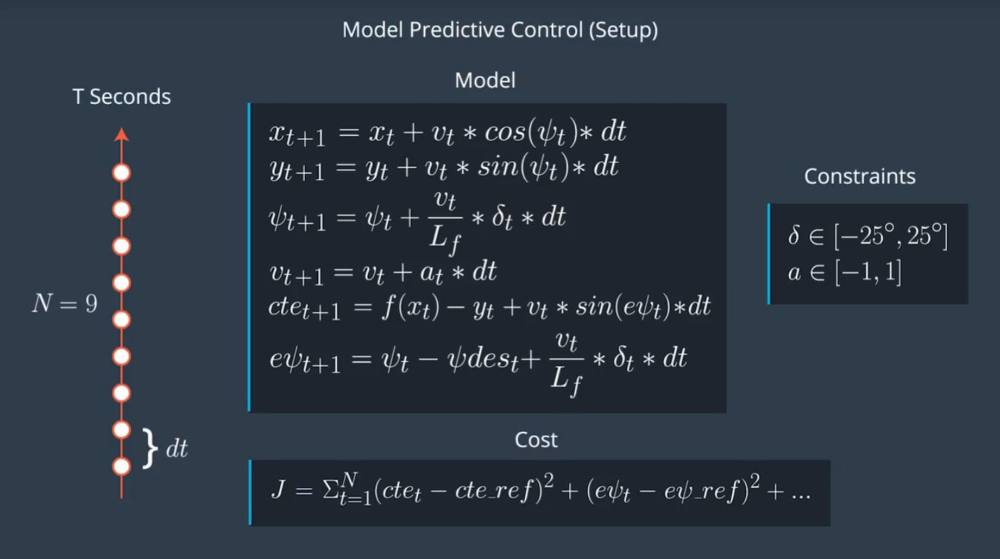
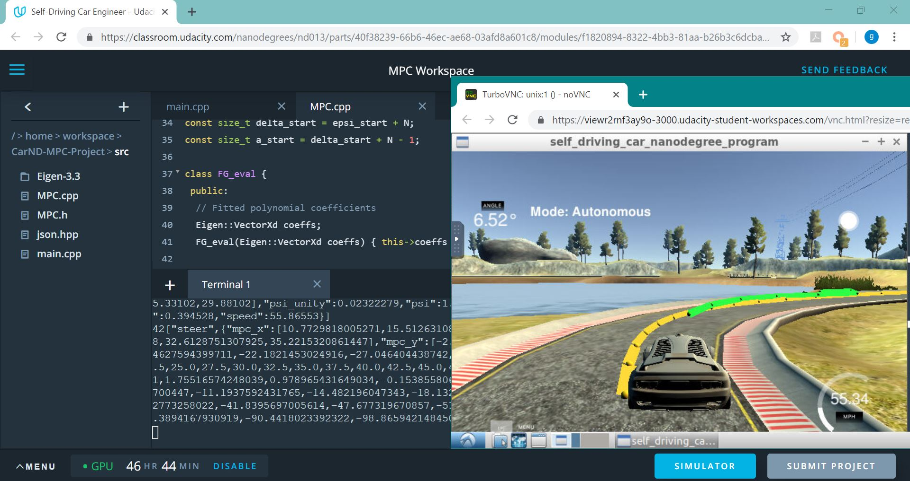

# CarND-Controls-MPC
Self-Driving Car Engineer Nanodegree Program - Model Predictive Control (MPC) Project

## Basic Build Instructions

1. Clone this repo.
2. Make a build directory: `mkdir build && cd build`
3. Compile: `cmake .. && make`
4. Run it: `./mpc`.

## Rubric points
### The Model
The model used is a Kinematic model neglecting the complex interactions between the tires and the road. The model equations are as follow: 
  

### Timestep Length and Elapsed Duration (N & dt)
The values chosen for N and dt are 10 and 100 milliseconds. These values mean that the optimizer is considering a one-second duration in which to determine a corrective trajectory.

### Polynomial Fitting and MPC Preprocessing
A 3rd-degree polynomial is fitted to the transformed waypoints, because it is known to fit most of the roads. Using a smaller order can result in underfitting while using a higher order can result in overfitting.

### Model Predictive Control with Latency
To handle actuator latency, the state values are calculated using the model and the delay interval. These values are used instead of the initial one.

This project was also run in Udacity workspace    
  
